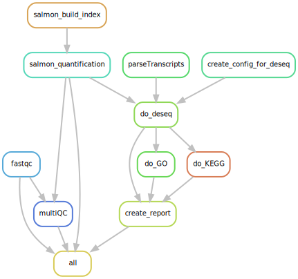

# Snakefile, config and scripts to run an RNA seq analysis


To use this pipeline, create a new repo using this one as a template (click the Use Template button).

Now, you need to confirm all the needed software is installed. The easiest way to do this is to install [miniconda](https://docs.conda.io/en/latest/miniconda.html), then create a conda environment to run in. I suggest:

```{sh}
conda env create -f envs/snake_no_conda
```

This will create a conda environment called snake_no_conda. If you want a different name, change it in the yaml file before creating.


You will need to create a metadata file for the samples.

You will need to create a configuration file.

For the list of samples, the format is:
samples:
    sample name:
        F: Forward reads file
        R: reverse reads file

If you have a lot of files, you may find the following shell command helpful:

```{sh}
# Assuming files look like {sample_name}_R1.fastq.gz

 for f in *R1*; do nm=${f%_R*}; echo "  ${nm}:"; echo "    F: $f"; echo "    R: ${f/R1/R2}"; done

```

Note the spacing is important to get the indent levels correct. Also note that you should avoid using an integer as the sample name, this will likely cause issues.


Use the files meta.txt and config.yaml as guides.

Reference transcriptome should be put in a folder called Data, and its name referenced in the config file. Note the file should have a suffix of .fa, which is not included in the config file.

Finally:

```{sh}
conda activate snake_no_conda

snakemake -n
snakemake --cores 32

conda deactivate
```

The first snakemake command is a dry run, which will build the dag and determine which jobs will need to be run. This is good practice, and helps trouble shoot issues with the config file or filenames. The second snakemake command will run the pipeline. Specify how many cores you want to use.


### The Pipeline


